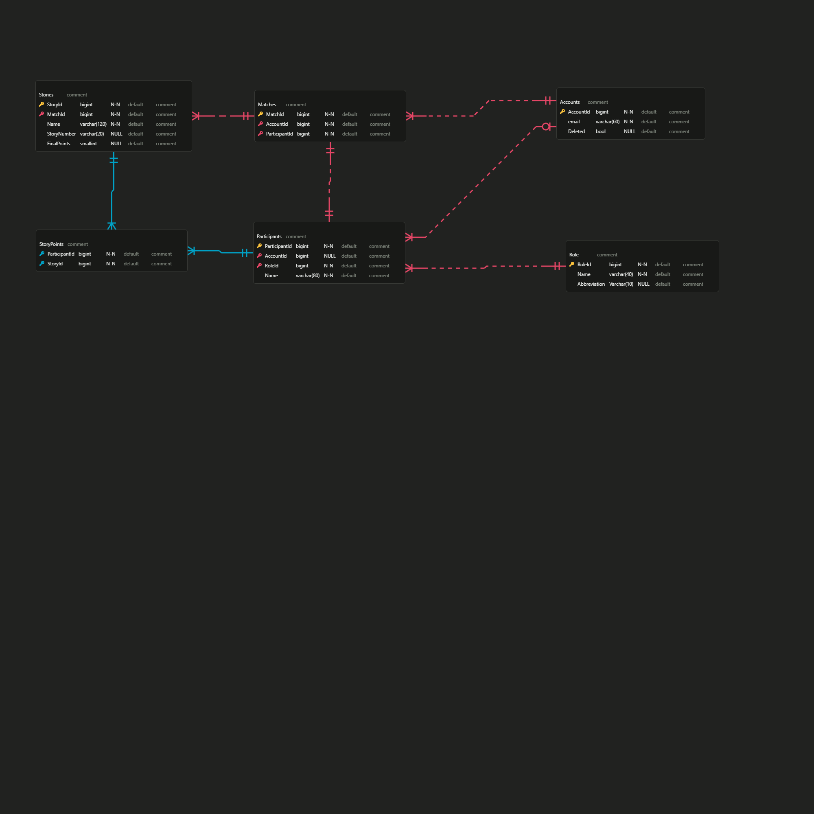

# Sprint Poker

Sprint Poker is a self-hosted application designed to help enterprises manage their planning processes for free. It requires only infrastructure and an Identity Provider (e.g., Active Directory, OAuth).

## Inspiration (Why)

In my workplace, we hold a planning ceremony every sprint to define new features that add business value. However, our current application limits participation to a maximum of six people, restricting the number of contributors who can provide points and perspectives for tasks, stories, and epics.

This application aims to solve the problem of user limits during sprint planning or other Scrum ceremonies, enabling larger teams to collaborate effectively by contributing points and viewpoints.

## Project Documentation

### Database

The database for this web application was modeled using [ERD Editor](https://erd-editor.io/).

- **Entity Relationship Diagram (ERD):**
  - [Version 1](./docs/erd/v1.json)

**Current Version:**  

### Use Cases

Not defined yet.

## Technical Knowledge You Can Learn

This project incorporates the following technologies and concepts:

### Backend (`C#`)

- **OAuth Firebase Integration**
- **ASP.NET Core**
- **SignalR** (Real-Time Communication Library)
- **CQRS** (Command Query Responsibility Segregation)
- **Notification Pattern** (Replaces Domain Exceptions)
- **Layered Architecture** (Feature-Based Organization)

### Frontend (`TypeScript`)

- **React.js**
- **Material-UI** (React.js Component Library)
- **Layered Architecture** (Feature-Based Organization)

## Screenshots

### Web

#### Dashboard

#### Create Match

#### Edit Story Modal

#### Sign-In Page

### Mobile

#### Complexity Selector

#### Join Match Page

#### Vote Screen

#### Empty Vote Screen
